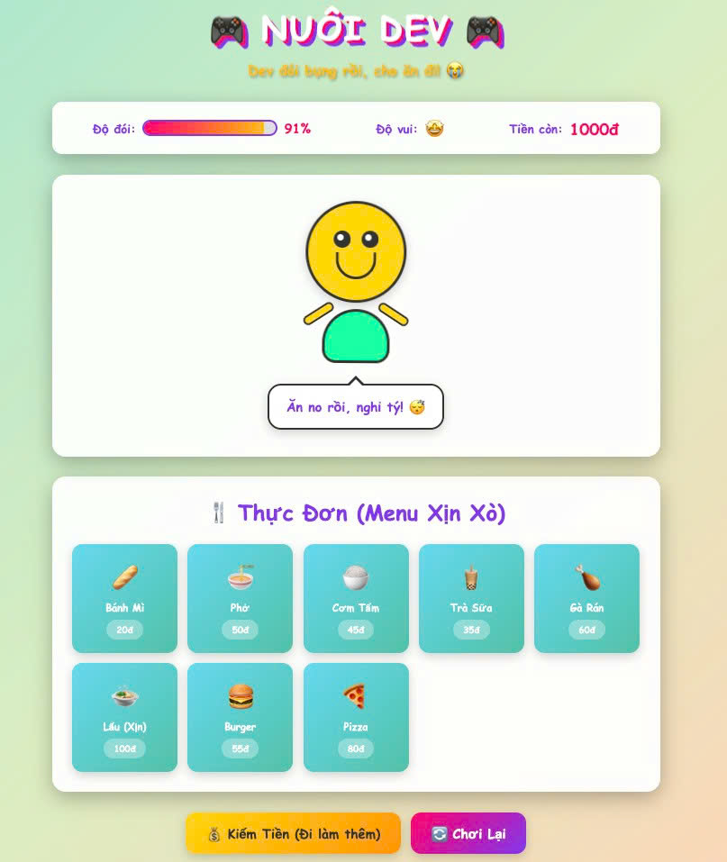

# 🎮 NUÔI DEV 🍗

> Lấy cảm hứng từ "Nuôi em" nhưng mà giờ đảo ngược lại rồi! Giờ BẠN phải cho dev ăn!

Fork from [codetoanbug/nuoianhem](https://github.com/codetoanbug/nuoianhem)

## 😭 Cái quái gì đây?

Chào mừng đến với **Nuôi Dev** - game nuôi thú ảo cách mạng nhất, thay vì cho gái anime ăn, giờ bạn phải cho... dev ăn (nghĩa là mấy thằng bro). Vì bình đẳng giới mà, hiểu chưa?

Đây là game PARODY CỰC KỲ NGHIÊM TÚC, bạn phải giữ cho dev no bụng nếu không nó sẽ chết đói (thật ra không đâu nhưng mà nó sẽ buồn lắm và đó là tệ hơn).

## 🤔 Tại sao lại có cái này?

- Tại sao không?
- Ai đó phải làm thôi
- Dev đói bụng rồi
- Vì meme
- Để lãng phí thời gian một cách có ích

## ✨ Tính năng xịn xò (có thể)

- **Hệ Thống Đói Động™**: Nhìn dev đói dần mỗi 3 giây với tâm trạng hoảng loạn
- **Nền Kinh Tế Thực Tế**: Kiếm đồng ảo để mua đồ ăn ảo cho thằng bạn ảo (giống đời thật nhưng buồn hơn)
- **8 Loại Đồ Ăn Việt Nam**: Từ bánh mì đến lẩu, có hết (trừ đồ ăn thật)
- **Thao Túng Cảm Xúc**: Dev sẽ làm bạn cảm thấy tội lỗi bằng mặt buồn và emoji khóc
- **AI Tiên Tiến**: Nhân vật biết chớp mắt. Giờ chúng tôi cũng như OpenAI rồi đó
- **Trứng Phục Sinh**: Bấm vào mặt dev. Nó không thích đâu. Cứ bấm thử đi
- **Cheat Code**: Vì chúng tôi tin vào tự do người chơi (và lười balance game quá)

## 🎯 Cách Chơi (Không khó đâu)

1. Mở file `index.html` trong trình duyệt
2. Nhìn dev đói của bạn
3. Cảm thấy tội lỗi
4. Mua đồ ăn
5. Xem tiền bay màu
6. Bấm nút "Kiếm Tiền" như điên
7. Lặp lại cho đến khi bạn tự hỏi mình đang làm gì với đời mình
8. ???
9. Lời (không thật đâu)

## 🕹️ Mẹo Pro Gamer

- **Đừng để thanh đói về 0%**: Dev sẽ SIÊU buồn luôn
- **Lẩu đắt nhưng xứng đáng**: Flex với mấy món cao cấp đi
- **Bánh mì cho game thủ nghèo**: Không sao, ai cũng từng vậy
- **Nhân vật đang nhìn chằm chằm vào bạn**: Đôi mắt kia... nhìn thấu tâm hồn bạn
- **Có Konami Code đó**: Tự tìm đi, tao không phải bồ câu đâu (thôi được rồi: ↑↑↓↓←→←→BA)

## 🐛 "Tính Năng" Đã Biết (chắc chắn không phải bug)

- Nhân vật có thể vẫy tay cực kỳ hăng
- Bong bóng chat chứa lượng meme Việt đáng báo động
- Game có thể làm bạn đói IRL
- Bạn có thể yêu luôn cái hình tròn vàng có mặt kia
- Comic Sans là cố ý. Chúng tôi không xin lỗi

## 🛠️ Tech Stack (rất chuyên nghiệp)

- **HTML**: Để làm cấu trúc (tối thiểu thôi)
- **CSS**: Để làm nó trông như cơn ác mộng
- **JavaScript**: Để làm ✨phép màu✨
- **Comic Sans MS**: Để tối đa hóa hiệu ứng hài
- **Vibe**: Hoàn hảo

## 📱 Yêu Cầu Hệ Thống

- Trình duyệt (bất kỳ trình duyệt nào từ thế kỷ này)
- Đôi mắt (khuyến nghị nhưng không bắt buộc)
- Khiếu hài hước (BẮT BUỘC)
- 5 phút cuộc đời bạn sẽ không bao giờ lấy lại được
- Khả năng chịu đựng trò đùa tồi

## 🤝 Đóng Góp

Tìm được bug à? Đó là tính năng.
Muốn thêm gì đó à? Fork rồi làm thoải mái.
Ghét Comic Sans à? Tiếc quá, nó ở lại.

## ⚠️ Tuyên Bố Miễn Trừ

- Không có dev thật nào bị tổn thương trong quá trình làm game này
- Đây là trò đùa. Hãy cho người thật ăn đồ ăn thật
- Chúng tôi không chịu trách nhiệm cho bất kỳ sự nghiện cho ăn ảo nào
- Tác dụng phụ có thể bao gồm: cười, khóc, nghi ngờ hiện thực
- Nếu thanh đói về 0%, đừng đổ lỗi cho chúng tôi vì tổn thương cảm xúc của bạn

## 📜 Giấy Phép

Làm gì thì làm. Nghiêm túc đó. Chúng tôi không phải mẹ bạn.
Đừng kiện chúng tôi nếu dev của bạn chết đói trong game nhé.

[MIT License](LICENSE) - Copyright (c) 2025 Codetoanbug

Ừ, giờ chúng tôi có giấy phép thật sự rồi đó. Xịn chưa?

## 🙏 Credits

- Lấy cảm hứng từ "Nuôi em" (OG nhất)
- Được xây dựng với tình yêu, meme và những quyết định đời sai lầm
- Cảm ơn đặc biệt: cà phê, Stack Overflow, và những buổi code lúc 3 giờ sáng
- Hỗ trợ tinh thần được cung cấp bởi: không ai, chúng tôi chịu đựng một mình

## 💬 Lời Cuối

Nếu bạn thực sự đọc hết cái README này, bạn là MVP thật sự.

Giờ đi cho dev ảo của bạn ăn đi. Nó đang đợi đó.

**Nhớ nhé**: Ở Soviet Nga, dev cho BẠN ăn! Khoan, nghe sai sai...

---

Made with 💀 và quá nhiều thời gian rảnh

*"Đói bụng không phải là trò đùa!"* - Sun Tzu, chắc vậy
